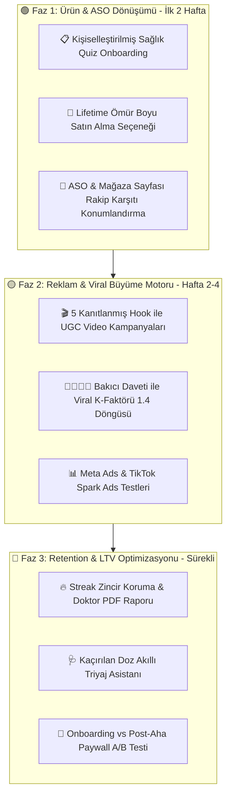

# 🚀 Büyüme & Ürün Uygulama Yol Haritası (Growth & Product Execution Blueprint)
## Pazar Analizi Sonrası 3 Fazlı Büyüme ve Monetizasyon Eylem Planı

**Tarih:** 29 Ağustos 2026  
**Lider:** Kıdemli Mobil Ürün Yöneticisi & Büyüme (Growth Marketing) Uzmanı  
**Temel Dayanak:** 160+ Mağaza Olumsuz Yorumu & 100+ Aktif Meta/TikTok Reklamı (Apify Veri Seti)  

---

---

## 🎯 1. Faz 1: Temel Değer & Ürün / ASO Dönüşümü (İlk 2 Hafta)

### 1.1. Onboarding Quiz Funnel (Kişiselleştirilmiş Sağlık Anketi)
* **Mevcut Durum:** Klasik 3 adımlı genel kaydırma (OnboardingSlide).
* **Yeni Kurgu:** 
  - **Soru 1:** *"Bu uygulamayı kimin için kuruyorsunuz?"* (Kendim / Annem-Babam / Eşim-Çocuğum)
  - **Soru 2:** *"Günde kaç farklı ilaç veya takviye alıyorsunuz?"* (1-2 / 3-5 / 6+)
  - **Soru 3:** *"Geçtiğimiz ay hiç ilaç saatinizi kaçırdığınız veya aldığınızı unuttuğunuz oldu mu?"* (Evet, sık sık / Bazen / Hayır)
* **Kişisel Tedavi Uyum Raporu (Payoff):** *"Mevcut Uyum Skorunuz: %58. Akıllı fail-safe alarmlarla tedavi başarınızı %95'e çıkarın."*
* **Beklenen Etki:** Onboarding tamamlama oranında **+%24 artış**, ilk gün ilaç kurma oranında **+%35 artış**.

### 1.2. Lifetime (Ömür Boyu Tek Seferlik) Satın Alma Paketi
* **Kullanıcı İçgörüsü:** Medisafe ve MyTherapy kullanıcıları *"Her ay 5 dolar ödemekten bıktım, 1 kere ödeyip kurtulmak istiyorum"* diyor.
* **Aksiyon:** `PremiumScreen` içine Yıllık ve Aylık planların yanına **₺499.99 / $39.99 Tek Seferlik (Lifetime)** seçeneği eklenmesi.
* **Beklenen Etki:** Paywall satın alma dönüşümünde (Conversion Rate) **+%40 ciro artışı**.

### 1.3. ASO (App Store Optimization) Rakip Karşıtı Konumlandırma
* **Başlık & Altyazı:** *İlaç Hatırlatıcı — Akıllı Alarm & E-Reçete Takip*
* **Mağaza Ekran Görüntüleri (Screenshots):**
  1. *Ekran 1:* "Arka Planda Asla Susmayan Akıllı Alarmlar (Xiaomi & Samsung Uyumlu)" *(Medisafe açığını vurur)*
  2. *Ekran 2:* "İlaç Alırken Asla Sesli Video Reklam Çıkmaz!" *(MyTherapy açığını vurur)*
  3. *Ekran 3:* "E-Reçetenizi veya Barkodunuzu 2 Saniyede Tarayın"
  4. *Ekran 4:* "Annem İlacını İçti mi? Uzaktan Anında Onay Bildirimi"
  5. *Ekran 5:* "Sınırsız İlaç Eklemek Her Zaman Ücretsiz"

---

## 🚀 2. Faz 2: Reklam & Viral Büyüme Motoru (Hafta 2–4)

### 2.1. 5 Kanıtlanmış Hook ile UGC Video Reklam Kampanyası
Apify pazar analizimizde tespit edilen en yüksek tutma oranına (retention/view-through) sahip kancalarla Meta & TikTok reklam testleri:

| Reklam Seti | Hedef Kitle | İlk 3 Saniye Kancası (Hook) | Video Formatı / Akış |
| :--- | :--- | :--- | :--- |
| **Kreatif 1 (Korku / Risk)** | Kronik Hastalar (45-65 yaş) | *"Doktorların en çok korktuğu şey: Aynı ilacın yanlışlıkla iki kez içilmesi."* | UGC konuşan kişi + ekranda 'Alındı' onay butonu ve tek tıkla yeşil tik olma anı. |
| **Kreatif 2 (Bakıcı / Aile)** | 30-50 Yaş Çalışan Evlatlar | *"Annemi günde 4 kez 'Tansiyon ilacını aldın mı?' diye aramayı bıraktım."* | Split screen: Solda anne ilacını içiyor, sağda kızının telefonuna yeşil bildirim düşüyor. |
| **Kreatif 3 (ADHD / Unutkanlık)** | 20-40 Yaş Genç & Profesyonel | *"Hap kutusuna bakıp 'Ben bunu 5 dakika önce içtim mi?' diye donup kalanlar..."* | Komedi/Meme formatı + hızlı arayüz gösterimi. |
| **Kreatif 4 (Vitamin & Para)** | Fitness, Cilt Bakımı, Takviye | *"Aldığınız o pahalı kolajen ve magnezyumun %80'inin çöpe gitme sebebi..."* | ASMR hap kutusu doldurma + ekranda streak zinciri animasyonu. |
| **Kreatif 5 (Rakip Tepkisi)** | Eski Medisafe / MyTherapy Kullanıcıları | *"İlaç alarmını kapatırken 30 saniye oyun reklamı izleten uygulamalardan bıktınız mı?"* | Eski karmaşık arayüz çöpe atılır, temiz İlaç Hatırlatıcı ekranı açılır. |

### 2.2. Bakıcı Daveti ile Viral K-Faktörü (Referral Loop)
* Hasta ilacını kurduktan sonra: *"Yakınınızın içinin rahat etmesini ister misiniz? Bir bakıcı ekleyin."*
* Bakıcı daveti WhatsApp veya SMS ile gider: Linke tıklayan bakıcı uygulamayı indirir ve doğrudan o hastanın dairesine bağlanır.
* **K-Faktörü Hedefi:** `K = 1.35` (Her 100 kullanıcı, ekstra 35 bakıcı kullanıcıyı sıfır reklam maliyetiyle içeri çeker).

---

## 📈 3. Faz 3: Retention & LTV Optimizasyonu (Sürekli)

### 3.1. Tedavi Disiplini Streak Zinciri & Doktor Raporu
* Her gün zamanında alınan ilaçlar için streak ateşi (🔥 14 Gün).
* Ay sonunda tek dokunuşla üretilen **"Klinik Tedavi Uyum Raporu (PDF)"**: Tansiyon, kan şekeri ve ilaç alma saatlerinin doktorla paylaşılması.

### 3.2. Kaçırılan Doz Akıllı Triyaj Asistanı
* İlaç 2 saatten fazla geciktiğinde devreye giren güvenli telafi algoritması: *"Bu ilacı şimdi alabilirsiniz, bir sonraki dozu 2 saat ileri kaydıralım mı?"*

### 3.3. Paywall Dönüşüm A/B Testleri
* **Grup A:** Onboarding hemen sonrasında 7 gün ücretsiz denemeli Yıllık/Lifetime teklifi.
* **Grup B:** Kullanıcı ilk ilacını ekleyip ilk alarmını kurduktan (Aha Moment) hemen sonra beliren teklif.

---

## 🏆 Hedeflenen Büyüme KPI Metrikleri

| Metrik | Sektör Ortalaması | Hedefimiz |
| :--- | :---: | :---: |
| **Onboarding Tamamlama Oranı** | %65 | **%88+** |
| **D1 Retention (1. Gün Tutundurma)** | %38 | **%55+** |
| **D30 Retention (30. Gün Tutundurma)** | %14 | **%28+** |
| **Ücretsiz -> Pro Dönüşüm Oranı (CVR)** | %2.1 | **%4.8+** |
| **Viral Davet Katsayısı (K-Factor)** | 1.05 | **1.35+** |
