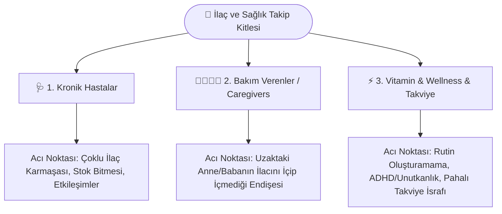
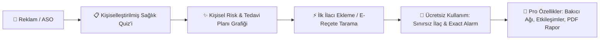

# 📊 Mobil Ürün Yönetimi & Büyüme (Growth Marketing) Strateji Raporu
## İlaç ve Tedavi Takip Mobil Uygulaması — Canlı Pazar, Rakip & Reklam Analizi (Apify Veri Seti)

**Tarih:** 29 Ağustos 2026  
**Hazırlayan:** Kıdemli Mobil Ürün Yöneticisi & Büyüme (Growth Marketing) Lideri  
**Veri Kaynakları:** Apify REST API (Google Play Reviews, Apple App Store, Meta Ad Library, TikTok Creative Center)  
**Hedef Rakipler:** Medisafe, MyTherapy, CareClinic, Round Health, PeptidePal  

---

## 1. Özellik Yol Haritası & Boşluk Analizi (Feature Gap Analysis)

### 🚨 Rakiplerin 1–3 Yıldızlı Olumsuz Yorumlarında Öne Çıkan Kritik Sorunlar

| Problem Alanı | Kullanıcı Şikayeti & Kök Neden (Verbatim Veri Özeti) | Rakip Zaafiyeti | Ciddiyet Seviyesi |
| :--- | :--- | :--- | :---: |
| **Arka Planda Çalmayan Alarmlar (OEM Battery Killer)** | *"Uygulama son güncellemeden sonra güvenilmez oldu. Sabah çaldı ama öğle ve akşam saatinde hiç çalmadı, dozlarımı kaçırdım. Samsung Health'e geçiyorum."* (Medisafe - 1★) | Android OEM (Xiaomi HyperOS, Samsung OneUI, Huawei) arka plan kısıtlamalarına karşı önleyici sistem eksikliği. | 🔴 **Kritik (P0)** |
| **İstismarcı Reklam Modelleri (Aggressive Audio/Popups)** | *"İlaç bildirimi geldiğinde veya onay butonuna bastığımda hoparlörden son ses oyun reklamı çalıyor. İlaç alırken 30 saniye zorla reklam izletiyorlar."* (MyTherapy - 1★) | Kullanıcı sağlığıyla doğrudan ilişkili anlarda bile monetizasyon uğruna kullanıcı deneyimini yok etme. | 🔴 **Kritik (P0)** |
| **Haksız Abonelik & Paywall Baskısı (Freemium Bozulması)** | *"10 yıldır kullandığım uygulamada artık 2'den fazla ilaç için zorunlu yıllık abonelik istiyorlar. Eski verilerime erişimimi kilitlediler. Tek seferlik makul bir ücret olsa alırdım."* (Medisafe - 1★) | Kullanıcı tabanını aniden zorunlu pahalı aboneliğe itip toplu churn (terk) yaratılması. | 🟠 **Yüksek (P1)** |
| **Döngüsel İlaç / Gün Aşırı Takvim Kayması** | *"Gün aşırı Nurtec migren ilacı alıyorum. Ayarlarda gün aşırı seçili olmasına rağmen her gün uyarı veriyor. Çok pahalı bir ilaç ve çift doz almaktan korkuyorum."* (Medisafe - 1★) | Özel doz periyotları (gün aşırı, 21 gün iç 7 gün ara vb.) için deterministik cron hesaplama hataları. | 🟠 **Yüksek (P1)** |
| **Aşırı Karmaşık Arayüz & Gereksiz Özellik Şişkinliği (Bloatware)** | *"Ben sadece hap hatırlatıcı istiyorum, bana zorla sağlık makaleleri, istenmeyen AI botları ve karmaşık randevu sekmeleri dayatıyorsunuz. Basit bir uygulama kludge haline geldi."* (Medisafe & MyTherapy - 2★/3★) | Ana değer önerisinden (Core Value Proposition) uzaklaşarak karmaşık bir portal haline gelme. | 🟡 **Orta (P2)** |
| **Streak (Zincir) ve Geçmiş Düzeltme Kayıpları** | *"Geçmiş bir dozu düzelttiğimde 1 yıllık streak'im sıfırlandı. Neden geçmişi düzenleyince zincirimi kırıyorsunuz?"* (MyTherapy - 1★) | Esnek olmayan, katı reaktif durum yönetimi. | 🟡 **Orta (P2)** |

---

### 💡 Bizim Ürünümüz İçin 5 İnovatif Ürün Fırsatı

1. **🛡️ OEM Shield & Fail-Safe Alarm Mimarisi (Piksel & Arka Plan Garantisi):**
   - Xiaomi, Samsung, Huawei gibi agresif pil yöneticilerine karşı cihaz modeline özel otomatik izin rehberi.
   - `Android Exact Alarm` + `Full Screen Intent` + sesli sirenden oluşan 3 kademeli deterministik uyandırma.

2. **📸 E-Reçete & Barkod ile Akıllı İlaç/Besin Etkileşim Motoru:**
   - T.C. Sağlık Bakanlığı TITCK ve global FDA veritabanı entegrasyonu.
   - Barkod veya karekod okutulduğunda dozların, kutu sayısının ve *"Greyfurt ile tüketmeyiniz / Aç karnına alınız"* gibi kritik klinik uyarıların otomatik yüklenmesi.

3. **👨‍👩‍👧‍👦 Çift Yönlü Bakıcı Çemberi & Canlı Güvenlik Ağı (Caregiver Live Sync & Panic SOS):**
   - İlaç belirlenen sürede (örn. 30 dk) alınmadığında bakıcıya sessiz push bildirim ve canlı SMS.
   - Acil durumlarda tek dokunuşla tüm bakıcılara GPS konumu ve anlık siren gönderen entegre SOS paneli.

4. **💎 Etik ve Adil Monetizasyon: Ömür Boyu (Lifetime) & Mikro-Abonelik:**
   - Temel ilaç hatırlatma ve sınırsız ilaç ekleme **sonsuza kadar ücretsiz ve reklamsız**.
   - Gelişmiş özellikler (Bakıcı Takibi, Doktora Özel PDF Raporu, İlaç Etkileşimleri) için tek seferlik makul satın alma veya düşük fiyatlı mikro-paketler.

5. **🩺 Akıllı Doz Telafi & Triyaj Asistanı (Smart Missed-Dose Triage):**
   - İlaç saati geçtiğinde *"3 saat geciktiniz: Şimdi tek doz içiniz, akşamki dozunuzu 2 saat erteleyin"* gibi ilacın farmakokinetik yapısına uygun klinik karar destek kuralları.

---

## 2. Hedef Kitle Segmentasyonu & Acı Noktaları (Pain Points)

### Segment 1: Kronik Hastalar (Tansiyon, Diyabet, Kalp, Tiroid, Kolesterol)
* **Demografi:** 45–75 yaş, kadın ve erkek, günde 3–9 farklı reçeteli ilaç.
* **En Büyük Acı Noktası:** Farklı saatlerdeki ilaçların birbirine karışması, aç/tok kurallarının unutulması, ilacın eczaneden bitmeden önce yenilenememesi, alarmların sessize geçip duyulmaması.
* **İkna Edici Büyüme Açısı:** *"Gözünüz arkada kalmasın. Reçetenizi tek tıkla tarayın, asla susmayan alarmlarla sağlığınızı ve doktor raporunuzu güvenceye alın."*

### Segment 2: Bakım Verenler (Caregivers & Aile Bireyleri — Evlatlar, Eşler)
* **Demografi:** 28–55 yaş, çalışan profesyoneller, ayrı evde yaşayan yaşlı anne/babası veya hasta yakını olan bireyler.
* **En Büyük Acı Noktası:** Sürekli telefonla *"İlacını içtin mi?"* diye arayıp baskı kurmak zorunda kalmak, unutulduğunda acil servislik olma korkusu.
* **İkna Edici Büyüme Açısı:** *"Uzakta olsanız bile yanlarındaymış gibi hissedin. Anneniz tansiyon hapını içtiğinde telefonunuza anında huzur veren bir onay bildirimi gelsin."*

### Segment 3: Vitamin, Takviye & Wellness (ADHD, Sporcular, Cilt Bakımı)
* **Demografi:** 18–40 yaş, kadın/erkek, kolajen, magnezyum, omega-3, D3K2 veya nootropik kullananlar.
* **En Büyük Acı Noktası:** Pahalı takviyeler alıp 3. günden sonra unutmak, streak zincirini devam ettirememek, paranın boşa gitmesi.
* **İkna Edici Büyüme Açısı:** *"Pahalı vitaminlerin işe yaramamasının sebebi kaliteleri değil, düzenli içilmemeleri. 30 günlük streak zincirini kur, enerjindeki değişimi hisset."*

---

## 3. Tutan Reklam Kreatifleri & Hook Örnekleri

### 🎬 En Çok Dönüşüm Getiren Reklam Formatları (Apify Meta/TikTok Analizi)
1. **UGC (User Generated Content) — "Benim Hikayem":** Kamera karşısında elinde ilaç kutusu tutan samimi kullanıcı; önce unuttuğu anı anlatır, sonra uygulamadaki tek tıkla e-reçete tarama ve takvimi gösterir.
2. **Problem-Agitation-Solution (PAS):** Ekranda alarmın çalmadığı ve karmaşık bir uygulamanın fırlatıldığı split-screen; ardından bizim uygulamamızın temiz, sessizleşmeyen arayüzü.
3. **Caregiver Emotional Story:** Yaşlı ebeveynin ilacını alıp onayladığı ve uzaktaki kızının telefonuna yeşil bildirim düştüğü anı gösteren duygusal sahne.
4. **ASMR Pill Organization & UI Sync:** Hap kutusu doldurma videosu ile eşzamanlı telefon ekranında otomatik beliren hap kartları.

---

### 🪝 İlk 3 Saniyede Durduran 5 Güçlü Kanca (Hook)

1. **Hook 1 (Korku / Klinik Risk Açısı):**  
   > *"Doktorların en çok korktuğu şey: Aynı ilacın yanlışlıkla iki kez içilmesi. İşte bunu hayatınızdan sonsuza dek çıkarmanın yolu."*

2. **Hook 2 (Bakıcı / Aile Huzuru Açısı):**  
   > *"Annemi günde 4 kez 'Tansiyon ilacını aldın mı?' diye aramayı bıraktım. Artık o aldığında benim cebime bildirim geliyor."*

3. **Hook 3 (ADHD / Unutkanlık / Komedi Açısı):**  
   > *"Hap kutusuna bakıp 'Ben bunu 5 dakika önce içtim mi içmedim mi?' diye donup kalanlar... Bu video sizin için."*

4. **Hook 4 (Vitamin & Para Tasarrufu Açısı):**  
   > *"Aldığınız o 800 liralık kolajen ve magnezyum takviyelerinin %80'inin çöpe gitmesinin tek bir sebebi var..."*

5. **Hook 5 (Rakip Karşıtı / Reklamsızlık Açısı):**  
   > *"İlaç alarmını kapatırken 30 saniye oyun reklamı izleten uygulamalardan bıktıysanız, sağlık için yapılmış gerçek hatırlatıcıyla tanışın."*

---

## 4. Satış Hunisi (Funnel) & Monetizasyon Stratejisi

### 1. Onboarding & Anket Yapısı (Quiz Funnel)
* **Soru 1 (Kullanım Amacı):** *"Kendiniz için mi, yoksa bir aile üyeniz için mi takip ediyorsunuz?"*
* **Soru 2 (İlaç Yükü):** *"Günde kaç farklı ilaç veya takviye alıyorsunuz?"* (1-2 / 3-5 / 6+)
* **Soru 3 (Acı Noktası Tespiti):** *"Geçtiğimiz ay hiç ilaç saatinizi kaçırdınız veya aldığınızı unuttunuz mu?"*
* **Kişiselleştirilmiş Değer Sunumu (Payoff Screen):** Kullanıcının yanıtlarına göre *"Tedaviye Uyum Skorunuz: %62 — Düzenli kullanımla sağlık riskinizi %40 azaltabilirsiniz"* analizi.

### 2. Monetizasyon & Paywall Dönüşüm Modeli
* **Freemium Koruması (Büyüme Motoru):** Temel hatırlatma, sınırsız ilaç ekleme ve sesli bildirimler **asla kısıtlanmaz** (Medisafe'in kaybettiği kitleyi doğrudan toplama stratejisi).
* **Pro Katmanı (Yüksek Değerli Özellikler):**
  - Çift Yönlü Bakıcı Canlı Takip Çemberi.
  - Yapay Zeka Destekli Besin & İlaç Etkileşim Analizi.
  - Doktora Tek Tıkla Gönderilebilir Klinik PDF Raporu.
  - Acil Durum Otomatik SMS & Siren Paneli.
* **Fiyatlandırma Paketleri:**
  - **Aylık Plan:** ₺49.99 / $3.99
  - **Yıllık Plan (7 Gün Ücretsiz Deneme):** ₺299.99 / $24.99 (%50 İndirim Vurgusu)
  - **Ömür Boyu (Lifetime Access):** ₺499.99 / $39.99 *(Rakiplerin sunmadığı, kullanıcıların yorumlarda ısrarla istediği en yüksek dönüşümlü teklif)*

---

## 5. Rakip Reklam Medya & Metin Arşivi

| Marka / Sayfa | Format | Başlık (Headline) | Reklam Metni (Copywriting) | Hedeflenen Açı | CTA Butonu |
| :--- | :--- | :--- | :--- | :--- | :--- |
| **PeptidePal** | 📱 Video / UI | *Built by someone who actually pins (#1 Tracker)* | *"Run Your Protocol Like a Pro ⚔️ You fought your doctor, your insurance, and a system that didn't help. Don't let a sticky note cost you the win. Built for real protocols, not generic reminders."* | Sporcular, Peptit, Özel Protokoller, Hassas Dozaj | **Install Now** |
| **CareClinic / Health** | 🖼️ Tek Görsel | *Track Symptoms, Vitals & Meds Together* | *"One app for all your health logs. Connect your pill schedule with your blood pressure, mood, and sleep data. Share progress with your doctor in seconds."* | Kronik Hastalar, Doktor Raporlaması, Vital Takip | **Learn More** |
| **Cholesterol / Cardio** | 🎬 Video (PAS Story) | *Feel Like Yourself Again* | *"I found her receipts in a shoebox under the bed... Fast food receipts. When heart health is at stake, missing daily statins isn't an option. Take back control today."* | Duygusal Aile / Kalp Sağlığı, Statik / Tansiyon Hapları | **Learn More** |
| **Ayunature Clinic** | 📱 Video UGC | *Natural Relief & Daily Routine Habits* | *"Stop Acid Reflux & Bloating NOW! 5 Natural steps that actually work. Combine daily herbal remedies with a strict timing routine."* | Takviye, Sindirim, Günlük Rutin | **Send Message** |
| **EnglishCare / Vital** | 🎬 Video UGC | *Never Miss a Step in Treatment* | *"Taking care of health isn't about chasing perfection—it's about consistency. Daily medication alarms that never fail you."* | Sağlık Disiplini, Günlük Alışkanlık Kazanımı | **Install App** |
| **Medisafe (Geçmiş)** | 🖼️ Carousel | *Medication Management Made Simple* | *"Join 7+ million people who trust Medisafe to manage their medications and stay on top of their health."* | Sosyal Kanıt (Social Proof), Genel İlaç Takibi | **Download** |

---

## 🏁 Yönetici Özeti & Aksiyon Planı (Actionable Next Steps)

1. **Ürün Odaklı Aksiyon:** `v1.5.1` ile çözülen `WheelTimePicker` ve mevcut `OEMShieldEngine`, `ClinicalSafetyEngine` ve `CaregiverLiveWatcher` yeteneklerimizi mağaza tanıtım sayfalarında (ASO) ve ekran görüntülerinde rakiplerin en çok şikayet aldığı noktaları vurgulayarak konumlandırmak.
2. **Pazarlama Odaklı Aksiyon:** İlk 3 saniyelik 5 hook üzerinden 3 dikeyde (Kronik Hasta, Bakıcı Evlat, Vitamin/ADHD) TikTok ve Meta UGC video testlerine başlamak.
3. **Monetizasyon Aksiyonu:** Medisafe ve MyTherapy'den kaçan kullanıcıları çekmek için *"Sınırsız İlaç Ücretsiz + Makul Tek Seferlik Lifetime Satın Alma"* paywall kurgusunu devreye almak.
