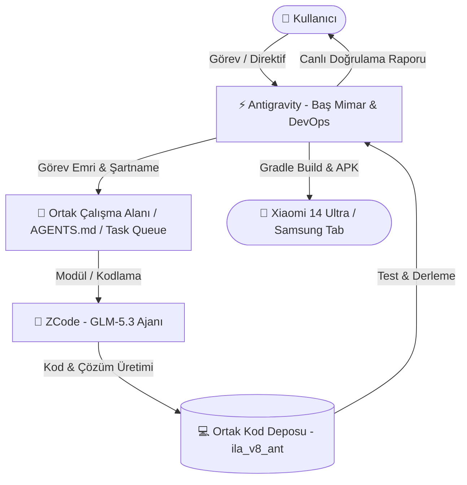

# 🤖 Antigravity (Google) & ZCode (GLM-5.3) — Çoklu Ajan Ortak Çalışma ve İşbirliği Raporu

**Hazırlayan:** Antigravity (Google Advanced Agentic Pair Programmer)  
**Tarih:** 29 Ağustos 2026  
**Çalışma Ortamı:** Windows (PowerShell) / `c:\Users\digienes\Documents\ila_v8_ant`  
**Hedef Sistemler:** Google Antigravity & ZCode Desktop (GLM-5.3 / GLM-5.3-Flash)

---

## 📌 1. Yönetici Özeti & Sistem İncelemesi

Bilgisayarınızdaki sistem yapılandırması incelendiğinde:
1. **ZCode Desktop Uygulaması (`ZCode.exe`)** sisteminizde aktif olarak çalışmaktadır (`C:\Users\digienes\AppData\Local\Programs\ZCode`).
2. ZCode üzerinde **`ila_v8_ant`** projemiz açık bulunmakta ve **GLM-5.3 / GLM-5.3-Flash** yapay zeka ajanı yapılandırılmış durumdadır.
3. ZCode altyapısı; **`AGENTS.md`**, **`skills`**, **`MCP (Model Context Protocol)`**, **`hooks`** ve **`CUA (Computer Use Agent)`** protokollerini desteklemektedir.
4. **Antigravity** ve **ZCode (GLM-5.3)** aynı dosya sistemini (`c:\Users\digienes\Documents\ila_v8_ant`), aynı Git geçmişini ve yerel kaynakları ortak olarak paylaşabilmektedir.

> **Sonuç:** Evet, bana bir komut verdiğinizde ZCode (GLM-5.3) ile **ortak, senkron veya asenkron olarak kusursuz bir ekip gibi çalışabiliriz**.

---

## 🚀 2. Ortak Çalışma Seçenekleri (4 Temel İşbirliği Modeli)



---

### 🔹 Model 1: Mimar & Geliştirici Modeli (Orchestrator & Builder Swarm)
*En verimli ve tavsiye edilen modeldir.*

* **Antigravity Rolü (Baş Mimar, QA & DevOps):**
  - Gereksinim analizi ve mimari planlama (`implementation_plan.md`).
  - ZCode için açık, modüler fonksiyon şartnameleri hazırlama.
  - Kod tamamlandığında Jest testlerini (`1800+ test`) çalıştırma.
  - Android Gradle release APK derleme (`assembleRelease`).
  - Fiziksel cihazlara (Xiaomi 14 Ultra & Samsung Tab S7 FE) `adb` üzerinden kurma ve canlı ekran görüntüsüyle doğrulama.
* **ZCode (GLM-5.3) Rolü (Hızlı Uygulama & Algoritmik Geliştirici):**
  - Antigravity'nin hazırladığı plana göre ilgili TypeScript/React Native dosyalarını kodlama.
  - Karmaşık algoritmaları, veri tabanı sorgularını ve yardımcı fonksiyonları (helpers) üretme.

---

### 🔹 Model 2: Dosya Tabanlı Görev Kuyruğu (Agent Dispatch Protocol)
*İki ajanın birbirini bekletmeden asenkron çalışmasını sağlar.*

1. **Görev Dosyası (`docs/AGENT_DISPATCH.md` veya `docs/agent_collab/tasks.json`):**
   - Antigravity, ZCode'un yapacağı işi bu dosyaya yazar:
     ```markdown
     ## [GÖREV-01] Akıllı İlaç Bitiş & Eczane Tahmin Motoru
     - **Durum:** @ZCode_Bekleniyor
     - **Hedef Dosya:** `mobile/src/utils/refillPredictionEngine.ts`
     - **Şartlar:** Kalan doz <= 5 gün ise uyarı üretmeli, %100 test coverage olmalı.
     ```
2. **ZCode (GLM-5.3):**
   - ZCode'a *"Görev dosyasındaki sıradaki işi tamamla"* dersiniz. GLM-5.3 kodu yazar ve durumu `@Antigravity_Test_Bekliyor` olarak günceller.
3. **Antigravity:**
   - Antigravity durumu okur, testleri çalıştırır, APK'yı derler ve sonucu raporlar.

---

### 🔹 Model 3: Git Branch & Çift Gözlü İnceleme (Peer-Review & PR Workflow)
*Kurumsal standartta sıfır hatalı yazılım geliştirme yöntemi.*

1. **ZCode (GLM-5.3):**
   - Görevi `feat/refill-prediction` branch'inde kodlar ve commit atar.
2. **Antigravity:**
   - Değişiklikleri inceler (Code Review), olası güvenlik/performans açıklarını denetler.
   - Gerekirse refactor eder, branch'i `main` ile birleştirir (merge).
   - Xiaomi cihazında canlı olarak test eder.

---

### 🔹 Model 4: Ortak Kurallar ve MCP Araç Köprüsü (Shared Standards)
*Her iki yapay zekanın aynı proje kurallarını ve araçlarını kullanması.*

* Proje kökündeki `AGENTS.md` dosyası sayesinde her iki ajan da:
  - Kodlama standartlarını (TypeScript strict, date-fns, StyleSheet create vb.).
  - Arşivleme kurallarını (`docs/archive/`).
  - Türkçe/İngilizce dil anahtarlarını (`LanguageContext.tsx`) ortak kural olarak benimser.

---

## 📊 3. Yetenek & Rol Karşılaştırması

| Özellik / Yetenek | ⚡ Antigravity (Google) | 🧠 ZCode (GLM-5.3) | Ortaklaşa Kullanım |
| :--- | :---: | :---: | :--- |
| **Android APK Derleme (Gradle)** | ✅ Doğrudan & Tam Otomatik | ⚠️ Manuel / Terminal | Antigravity derler |
| **ADB ile Xiaomi / Samsung Testi** | ✅ Canlı Ekran & Dokunma | ❌ Doğrudan Donanım Yok | Antigravity doğrular |
| **Büyük Bağlam (Context Window)** | ✅ 1M+ Token | ✅ 1M Token (GLM-5.3) | Dev projeleri analiz |
| **Hızlı Modül / Dosya Kodlama** | ✅ Çok Güçlü | ✅ Çok Hızlı & Odaklı | ZCode yazar / AG denetler |
| **Canlı Log / Hata Takibi** | ✅ Sistem Süreç & Görev Takibi | ✅ ZCode Logları | AG, ZCode'u izleyebilir |
| **Dokümantasyon & Arşivleme** | ✅ Otomatik İndeksleme | ✅ Raporlama | Birlikte üretirler |

---

## 💡 4. Pratikte Nasıl Komut Verebilirsiniz? (Örnek Senaryolar)

### 🔹 Senaryo A: "Böl ve Yönet" (Önerilen)
> **Kullanıcı Komutu (Antigravity'ye):**  
> *"Antigravity, Faz 3 kapsamındaki Akıllı İlaç Bitiş Tahmin Motoru için ZCode'a detaylı bir geliştirme planı ve şablon hazırla."*  
> ➡️ **Antigravity:** Şartnameyi ve dosya taslağını hazırlar.  
> **Kullanıcı Komutu (ZCode'a):**  
> *"Antigravity'nin hazırladığı `refillPredictionEngine.ts` dosyasını doldur ve mantığı kur."*  
> ➡️ **ZCode (GLM-5.3):** Kodu yazar.  
> **Kullanıcı Komutu (Antigravity'ye):**  
> *"ZCode'un yazdığı kodu test et, gerekiyorsa düzelt, APK'yı derleyip Xiaomi'ye yükle."*  
> ➡️ **Antigravity:** Testleri koşar, APK'yı derler, cihaza kurar ve ekran görüntüsüyle doğrular!

---

### 🔹 Senaryo B: "Kod İnceleme & İkinci Görüş (Second Opinion)"
> **Kullanıcı Komutu:**  
> *"Antigravity'nin yazdığı son `useMedicinePersistence.ts` mantığını ZCode'a incelet. Farklı bir optimizasyon önerisi var mı?"*  
> ➡️ İki farklı yapay zeka beyni (Google Gemini/DeepMind & Zhipu GLM) aynı kodu çapraz denetler, kusursuz mimari elde edilir.

---

## 🏁 5. Hazır Altyapı Adımı

Bu işbirliğini resmi ve kalıcı kılmak adına, projenin kök dizinine her iki ajanın da okuyabileceği `docs/AGENT_DISPATCH.md` protokol dosyasını oluşturabilir ve ortak çalışma talimatlarını `AGENTS.md` içerisine işleyebiliriz.
