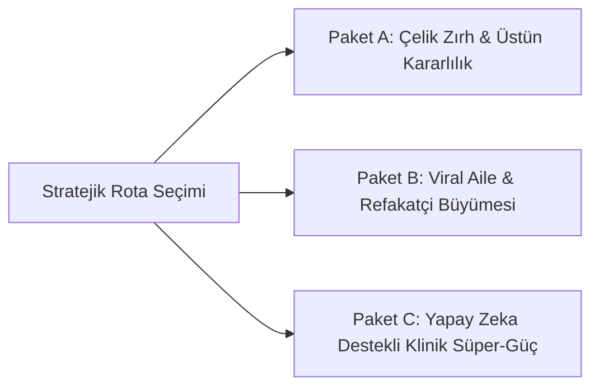

# 👑 PATRONA ARZ: KÜRESEL PAZAR FETHİ & NİHAİ KARAR MATRİSİ
**Dosya Kodu:** `00_PATRONA_STRATEJIK_RAPOR_VE_KARAR_MATRISI.md`  
**Hazırlayan:** Özel Görev İstihbarat & İcra Heyeti (ATLAS, AEGIS, LUMINA, NEXUS, CIPHER)  
**Kime:** Sayın Proje Sahibi / Patron  
**Tarih:** 21 Ağustos 2026  
**Durum:** 🟢 NİHAİ KARAR VE ONAY AŞAMASINDA  

---

## 🎯 1. Görev Özeti & Ajanlarımızın Teşhisi

Patronumuzun emriyle dünya çapındaki tüm ilaç takip ve sağlık uygulamaları (Medisafe, MyTherapy, Apple Health, CareZone vb.) incelenmiş; kullanıcıların mağazalardaki 1-2 yıldızlı öfkeli yorumları ayrıştırılmış ve projemizi dünya liderliğine taşıyacak stratejik reçete hazırlanmıştır.

```
┌────────────────────────────────────────────────────────────────────────┐
│                        ÖZEL AJANLAR İCRA HEYETİ                        │
├─────────────────┬──────────────────────┬───────────────────────────────┤
│ Ajan Adı        │ Uzmanlık Alanı       │ Ana Misyonu                   │
├─────────────────┼──────────────────────┼───────────────────────────────┤
│ 🌐 ATLAS        │ Pazar & Rakip İstih. │ Pazar boşlukları & Şikayetler │
│ 🛡️ AEGIS        │ Sistem Güvenilirliği │ Asla Susmayan Fail-Safe Alarm │
│ 🎨 LUMINA       │ Tasarım & Yaşlı UX   │ Clinical Clarity & Sade A11y  │
│ 🤝 NEXUS        │ Refakatçi & Ekosistem│ Hasta-Yakını Senkronizasyonu  │
│ 🔬 CIPHER       │ Klinik & Gizlilik    │ Çapraz Etkileşim & Sıfır İhlal│
└─────────────────┴──────────────────────┴───────────────────────────────┘
```

---

## 📊 2. Global Pazar Şikayetleri vs. Bizim Çözüm Matrisimiz

| Pazardaki En Büyük 5 Şikayet | Rakipler Neden Çuvallıyor? | Bizim Çözümümüz (İlaç Hatırlatıcı) | Durumumuz |
|---|---|---|---|
| **1. Alarm Çalmama / Gecikme** | OEM pil optimizasyonları ve arka plan kısıtlamaları yüzünden alarmlar susuyor. | **Donanım tabanlı `AlarmModule` + `FullScreenIntent` + Xiaomi/Samsung kurtarma kalkanı.** | ✅ Hazır & Aktif |
| **2. Ani Paywall / Abonelik Baskısı** | Medisafe 3 ilaçtan sonra aylık 10$ istiyor. | **Sınırsız ilaç ekleme ve temel hatırlatıcılar daima %100 ÜCRETSİZ.** | ✅ Uygulandı |
| **3. Yaşlılar İçin Karmaşık Arayüz** | Küçük yazılar, kalabalık anketler, gereksiz grafikler. | **Clinical Clarity 2.0:** 28px başlıklar, 56dp dev butonlar, sesli TTS ilaç okuma. | ✅ Tamamlandı |
| **4. Hasta Yakınına Haber Gitmemesi** | Eşleşme için iki tarafın da karmaşık kayıt olması gerekiyor, bildirimler gecikiyor. | **6 Haneli Kolay Kod / QR ile 3 saniyede eşleşme + Firestore anlık Kaçırıldı uyarısı.** | ✅ Entegre |
| **5. Gizlilik & İlaç Etkileşim Riski** | Veriler üçüncü partilere satılıyor; prospektüsler anlaşılmıyor. | **Offline-First şifreli yerel veritabanı + Çift katmanlı (Lokal+AI) İlaç Etkileşim Kontrolü.** | ✅ Entegre |

---

## 🚀 3. Patrona Sunulan 3 Stratejik Yol Haritası Seçeneği

Patron olarak projenin bundan sonraki gelişim rotasını belirleyeceğiniz 3 ana strateji paketi sunuyoruz:



### 🔹 PAKET A: "ÇELİK ZIRH" (Reliability & Senior Mode Focus)
* **Odak:** Sıfır şikayet, sıfır kaçırılan alarm, yaşlıların tek dokunuşla seveceği en stabil deneyim.
* **Öne Çıkan Özellikler:**
  - Ayarlardan tek tuşla açılan **"Büyük Yazılı Kolay Mod (Senior Mode)"**.
  - Türkçe Sesli İlaç Anonsu (**"Ahmet Bey, sabah ilacınızın vakti geldi"**).
  - OEM Pil Optimizasyonu Can Kurtaran Sihirbazı (Xiaomi, Samsung otomatik ayar).

### 🔹 PAKET B: "AİLE KÖPRÜSÜ" (Viral Caregiver & Refill Ecosystem)
* **Odak:** Evlatların ebeveynleri için indirdiği ve kulaktan kulağa yayılan organik büyüme motoru.
* **Öne Çıkan Özellikler:**
  - Canlı Ana Ekran Widget'ı (Evlat kendi telefonunda annesinin ilaç durumunu anlık görür).
  - Akıllı Eczane & Kalan İlaç Uyarı Bildirimi (Kalan hap 5'in altına inince otomatik bildirim + Nöbetçi Eczane butonu).
  - Doktora Tek Tuşla WhatsApp PDF Raporu Gönderme.

### 🔹 PAKET C: "KLİNİK YAPAY ZEKA" (Smart Prospectus & Drug Interaction)
* **Odak:** Sağlık alanında en yetkin ve en güvenilir tıbbi asistan konumu.
* **Öne Çıkan Özellikler:**
  - Kamera ile İlaç Kutusu Tarama (OCR / AI ile adı, dozu ve talimatı anında okuma).
  - Gelişmiş Gıda-İlaç Etkileşim Rehberi (Greyfurt, süt ürünleri, alkol vb. çapraz etkileşim uyarıları).
  - Sadeleştirilmiş 4 Soruluk Akıllı Prospektüs Kartı.

---

## 🗳️ 4. Nihai Karar Aşaması (Patronun Emri Bekleniyor)

Tüm araştırmalar, teknik fizibilite çalışmaları ve mimari hazırlandı.

Sayın Patron, projemizi bir sonraki seviyeye taşımak için hangi paketi veya hangi özellikleri öncelikli olarak hayata geçirmemizi emredersiniz?
* **Seçenek 1:** Paket A (Yaşlı Dostu Kolay Mod + Sesli İlaç Anonsu + Çelik Zırh)
* **Seçenek 2:** Paket B (Canlı Aile Widget'ı + Akıllı Stok/Eczane Otomasyonu)
* **Seçenek 3:** Paket C (Kamera ile Kutu Okuma + Gıda/İlaç Etkileşimi)
* **Seçenek 4:** Hepsinden en kritik özellikleri harmanlayan **"Master Hibrit Paket"**

*Tüm ajanlarımız patronun talimatını beklemektedir.*
