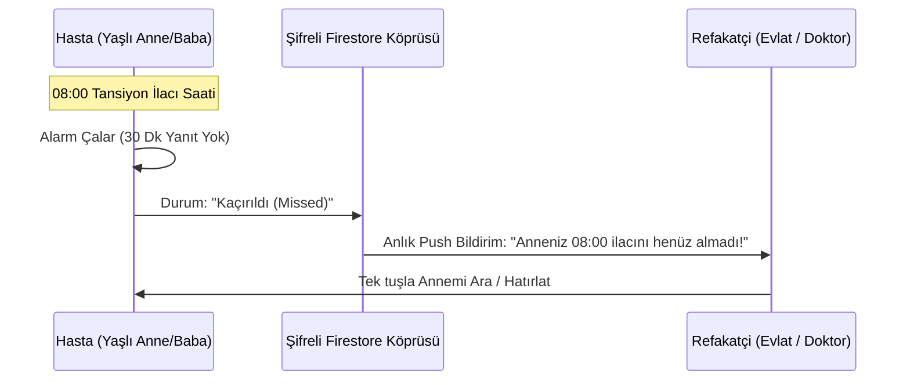

# 🤝 AJAN 4: NEXUS — Hasta-Yakını Senkronizasyonu & Sağlık Ekosistemi Raporu
**Kod Adı:** NEXUS  
**Rütbe / Görev:** Caregiver Architecture & Healthcare Ecosystem Director  
**Kime:** Patrona (Chief Executive Officer)  
**Tarih:** 21 Ağustos 2026  
**Durum:** TAMAMLANDI / İNCELEMEYE HAZIR  

---

## 1. Pazardaki En Büyük Aile Çaresizliği: "Annem İlacını Aldı mı?"
Global pazardaki kullanıcı yorumlarının en duygusal ve kritik kısmı hasta yakınlarına (Caregivers) aittir:

1. **İmkansız Eşleştirme:** Rakiplerde hasta yakını eklemek için her iki tarafın da hesap açıp, e-posta onaylayıp, karmaşık şifrelerle uğraşması gerekiyor. Yaşlı ebeveyn bu aşamayı geçemiyor.
2. **Geciken Bildirimler:** Hasta ilacı almadığında çocuğuna bildirim gitmiyor veya 3 saat sonra gidiyor.
3. **Stok Takipsizliği:** İlaç kutusunda son 2 hap kaldığında kimsenin haberi olmuyor; nöbetçi eczane aramak zorunda kalınıyor.
4. **Doktora Rapor Sunamama:** Doktor "Son 3 ayda tansiyon ilacınızı düzenli aldınız mı?" diye sorduğunda hastanın "galiba aldım" demesi.

---

## 2. Bizim Geliştirdiğimiz "Nexus-Sync" Sistemi

Uygulamamızda hasta ve refakatçi arasındaki bağı kopmaz bir köprüye dönüştürüyoruz:

### Güçlü Yanlarımız:
1. **6 Haneli Kolay Kod veya QR Kod ile Eşleşme:**
   - Yaşlı ebeveyn sadece ekrandaki QR kodu veya 6 haneli kodu çocuğuna gösterir. 3 saniyede anında çift yönlü senkronizasyon kurulur!
2. **Akıllı Stok Takibi & Nöbetçi Eczane Köprüsü:**
   - Kalan hap sayısı 5'in altına düştüğünde uyarı verir.
   - Tek dokunuşla en yakın nöbetçi eczaneyi bulup yol tarifi açar (`pharmacyService.ts`).
3. **Doktora Özel "Klinik PDF Raporu":**
   - Tek tuşla son 30/90 günlük ilaç uyum tablosunu, atlanan günleri ve tansiyon/şeker notlarını resmi bir klinik PDF raporu haline getirip WhatsApp veya E-Posta ile doktora gönderir (`pdfReportHelpers.ts`).

---

## 3. NEXUS'un Patrona Önerdiği 3 Dev Adım

1. **"Gözüm Arkada Kalmasın" Widget'ı:**
   - Çocuğun telefonunun ana ekranında (iOS/Android Widget) annesinin gün içindeki ilaç durumu canlı olarak "Yeşil / Sarı / Kırmızı" halka şeklinde görünür.
2. **E-Reçete / SGK İlaç Bitiş Hatırlatıcısı:**
   - "Raporlu ilacınızın süresi 10 gün sonra doluyor, doktordan randevu alınız."
3. **Refakatçi İlaç Yönetimi:**
   - Uzaktaki evlat, kendi telefonundan annesinin ilaç listesine yeni bir antibiyotik ekleyebilir; annesinin telefonunda anında alarm kurulur.

---

## 4. Patrona Özel Not (NEXUS'un Notu)
> *"Patron, ilaç hatırlatıcı uygulamasını sadece hastalar indirmez; asıl indirenler ebeveynleri için endişelenen 30-50 yaş arası evlatlardır! Eğer 'Refakatçi' deneyimini pürüzsüz yaparsak, uygulamamız kulaktan kulağa aileler arasında bir numaralı tercih olacaktır."*
