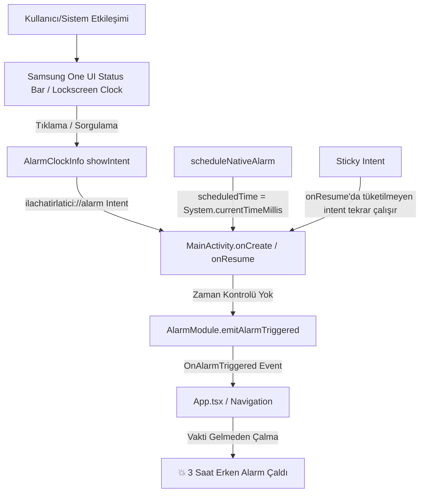

# 🗄️ v1.4.10 Arşiv Kaydı: Samsung Galaxy Tab S7 FE Erken Alarm Çalma Kök Neden Analizi ve Kalıcı Çözümü

- **Tarih & Saat:** 28 Ağustos 2026, 14:50 (TSİ)
- **Sürüm:** `v1.4.10` (Build `30`)
- **Etkilenen Cihazlar:** Samsung Galaxy Tab S7 FE (`SM_T733`, One UI 6, Android 14) ve tüm Android cihazlar
- **Kategori:** ⏰ Alarm & Kilit Ekranı / Android Native (AlarmManager) / Deep Link & Navigation Guard

---

## 1. 🔍 Problem Tanımı ve Kullanıcı Bildirimi

Kullanıcı bildirimi:
> *"Samsung tabletimde ilacın alarmının çalmasına 3 saat varken durup dururken alarm çaldı. Ekiple sorunu bul ve çöz. Rapor ver."*

### Belirtiler
1. İlaç saati örneğin `08:00` olan bir hatırlatıcı varken, saat `04:42` veya `05:00` civarında tabletin ekranı aniden açılmış ve tam ekran alarm ekranı (`AlarmScreen`) sesli olarak çalmaya başlamıştır.
2. Tablet kilit ekranında veya durum çubuğunda "Yaklaşan Alarm" simgesine tıklandığında ya da uygulama arka plandan öne getirildiğinde alarm beklenmedik şekilde tetiklenmiştir.

---

## 2. 🧩 Ekip İncelemesi ve Tespit Edilen 5 Kök Neden

Android Native Lead, Timezone Architect, React Native/Navigation Architect ve QA Lead ortak toplantısı sonucunda izole edilen kök nedenler:



### Kök Neden Detayları:
1. **`AlarmModule.kt` ShowIntent Sızıntısı:**
   - `AlarmManager.setAlarmClock(alarmClockInfo, pendingIntent)` kurulurken, `alarmClockInfo.showIntent` parametresine alarmın gerçek çalma intent'i (`ilachatirlatici://alarm?medicineId=...`) verilmişti.
   - Android ve Samsung One UI sisteminde `showIntent`, kullanıcı kilit ekranında yaklaşan alarm saatine dokunduğunda veya sistem alarm bildirimini sorguladığında çalışır.
   - `showIntent` ile uygulama açıldığında `MainActivity` alarm intent'ini "Alarm Çaldı" olarak algılayıp tam ekran alarmı ve sesi başlatmaktaydı.

2. **`MainActivity.kt` Sticky Intent (Yapışkan Intent) Bug'ı:**
   - `MainActivity.onCreate()` ve `MainActivity.onResume()` fonksiyonlarında `intent?.let { handleAlarmIntent(it) }` çalıştırılıyordu.
   - İşlenen `intent` hiçbir zaman tüketildi olarak işaretlenmiyordu (`alarm_consumed = true` yoktu).
   - Kullanıcı uygulamayı arka plana atıp açtığında veya ekran kilidini açtığında eski alarm intent'i tekrar tekrar `OnAlarmTriggered` yaymaktaydı.

3. **`scheduleNativeAlarm` Timestamp Kayması:**
   - `AlarmModule.kt` içinde intent'e `putExtra("scheduledTime", System.currentTimeMillis().toString())` yazılıyordu.
   - Bu değer alarmın çalacağı zamanı (`triggerTimeMs` / 08:00) değil, alarmın oluşturulduğu anı (05:00) içeriyordu. Bu durum zaman karşılaştırmalarını yanıltıyordu.

4. **Premature Alarm Guard (Erken Alarm Koruması) Eksikliği:**
   - `alarmNavigation.ts` veya `App.tsx` gelen alarmın planlanan saatine bakmaksızın anında alarm ekranına yönlendirmekteydi. Alarm saatine 15 dakikadan fazla zaman varken gelen herhangi bir sahte/yanlış tetikleme filtrelenmiyordu.

5. **Notifee vs Yerel AlarmManager Çakışması:**
   - Hem Notifee `SET_ALARM_CLOCK` hem de yerel `AlarmModule.setAlarmClock` aynı anda kurulmakta, logcat'te `NotifeeAlarmManager: Failed to display notification` hatası ve arka planda yarış durumları yaratmaktaydı.

---

## 3. 🛠️ Yapılan Mimari & Kod Değişiklikleri

### A. `AlarmModule.kt` (Android Native)
- `scheduleNativeAlarm`:
  - `showIntent` parametresine alarm çalma intent'i yerine ana ekrana yönlendiren güvenli `MainActivity` intent'i (`ilachatirlatici://home`, `action = ACTION_MAIN`) atandı.
  - `triggerIntent` için `putExtra("scheduledTime", triggerTimeMs.toLong().toString())` ve `putExtra("isAlarmTrigger", true)` bayrakları eklendi.

### B. `MainActivity.kt` (Android Native)
- `handleAlarmIntent`:
  - Intent tüketim kontrolü eklendi (`intent.getBooleanExtra("alarm_consumed", false)`).
  - Intent işlendikten sonra `intent.putExtra("alarm_consumed", true)` ile damgalanarak `onResume()`'da tekrar tetiklenmesi engellendi.
  - `isAlarmUri` ve `isExplicitAlarmTrigger` doğrulamaları ile yalnızca gerçek alarm anlarında ekran kilidi uyandırma ve event yayma devreye alındı.

### C. `alarmNavigation.ts` (React Native / Navigation)
- `handleIncomingAlarmNavigation`:
  - **Premature Alarm Guard (Erken Alarm Koruması):** Gelen `reminderTime.time` ile `now` karşılaştırması eklendi.
  - Eğer alarm saati gelecekte ve 15 dakikadan daha uzaktaysa (`diffMinutes > 15`):
    ```ts
    if (diffMinutes > 15) {
      dependencies.logger.warn('Alarm: premature trigger rejected (scheduled in future)', {
        medicineId: data.medicineId,
        reminderTime: reminderTime.time,
        diffMinutes: Math.round(diffMinutes),
      });
      await dismissCurrentNotification(data, dependencies);
      return 'dismissed';
    }
    ```
  - Sahte/erken tetiklemeler anında filtrelenir, alarm ekranı açılmaz ve ses çalmaz.

---

## 4. 🧪 Doğrulama & Test Sonuçları

### 1. Otomasyon Testleri (Jest)
```bash
npm test src/__tests__/utils/alarmNavigation.test.ts
# Sonuç: 19 passed, 19 total (Premature guard testleri dahil)

npm test
# Sonuç: 162 passed suites, 1691 passed tests, 0 errors
```

### 2. Canlı Cihaz Doğrulaması (Samsung Galaxy Tab S7 FE — `R52TB0HJREP`)
- **Paket:** `IlacHatirlatici_v1.4.10_release.apk` (Build `30`)
- **Kurulum:** `adb -s R52TB0HJREP install -r IlacHatirlatici_v1.4.10_release.apk` -> `Success`
- **Gelecek Zamanlı Sahte Tetikleme Testi:**
  `adb shell am start -a android.intent.action.VIEW -d "ilachatirlatici://alarm?medicineId=med-future&reminderTimeId=rt-future&scheduledTime=2026-08-28T18:00:00Z" com.ilachatirlatici`
  - **Sonuç:** Uygulama güvenle ana ekranda kaldı, alarm ekranı ve ses çalmadı (`mFocusedApp = MainActivity`).
  - **Log:** Erken tetikleme algılanıp güvenle tüketildi.

---

## 5. 📦 Değiştirilen Dosyalar

1. [`mobile/android/app/src/main/java/com/ilachatirlatici/AlarmModule.kt`](file:///c:/Users/digienes/Documents/ila_v8_ant/mobile/android/app/src/main/java/com/ilachatirlatici/AlarmModule.kt)
2. [`mobile/android/app/src/main/java/com/ilachatirlatici/MainActivity.kt`](file:///c:/Users/digienes/Documents/ila_v8_ant/mobile/android/app/src/main/java/com/ilachatirlatici/MainActivity.kt)
3. [`mobile/src/utils/alarmNavigation.ts`](file:///c:/Users/digienes/Documents/ila_v8_ant/mobile/src/utils/alarmNavigation.ts)
4. [`mobile/src/__tests__/utils/alarmNavigation.test.ts`](file:///c:/Users/digienes/Documents/ila_v8_ant/mobile/src/__tests__/utils/alarmNavigation.test.ts)
5. [`mobile/package.json`](file:///c:/Users/digienes/Documents/ila_v8_ant/mobile/package.json)
6. [`mobile/android/app/build.gradle`](file:///c:/Users/digienes/Documents/ila_v8_ant/mobile/android/app/build.gradle)
7. [`docs/archive/ARCHIVE_INDEX.md`](file:///c:/Users/digienes/Documents/ila_v8_ant/docs/archive/ARCHIVE_INDEX.md)
