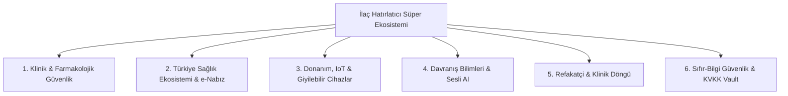

# 🌍 Dünya ve Türkiye Standartlarında İlaç Hatırlatıcı Geliştirme, Eksiklik Analizi ve İnovasyon Raporu

**Tarih:** 2026-08-28 16:15  
**Raporu Hazırlayan:** Çapraz Fonksiyonel Uzman Kurulu (Klinik Farmakoloji, Mobil Sistemler, Türkiye Dijital Sağlık, Davranış Bilimleri, Biyo-Uyum & Ürün Yönetimi)  
**Kapsam:** Dünya (Medisafe, MyTherapy, Apple Health, EveryDose, NHS) ve Türkiye (Sağlık Bakanlığı e-Nabız, TİTCK, SGK Medula, İTS, Eczane Ekosistemi) Kıyaslamalı Eksiklikler, Verimlilik Artırıcı Yöntemler ve Stratejik Vizyon  
**Kodlama Durumu:** Kodlama yapılmadı (Salt Araştırma, Strateji, Mimari ve Ürün Raporu)

---

## 🏛️ Çapraz Fonksiyonel Uzman Kurulu Heyeti

1. **👨‍⚕️ Baş Klinik Farmakolog & Tıbbi Güvenlik Direktörü (Chief Medical Officer & Clinical Pharmacologist)**
2. **📱 Baş Mobil & Gömülü Sistemler Mimarı (Principal Mobile Systems & IoT Architect)**
3. **🇹🇷 Türkiye Dijital Sağlık & Regülasyon Lideri (Turkey Digital Health, e-Nabız & TİTCK Lead)**
4. **🎨 Davranış Bilimleri & Erişilebilirlik Baş Tasarımcısı (Lead Behavioral UX & Accessibility Scientist)**
5. **🛡️ Sağlık Verisi Güvenliği, KVKK & Biyo-Uyum Sorumlusu (Health Privacy & Compliance Officer)**
6. **📈 Ürün Stratejisi & Dijital Sağlık Büyüme Direktörü (VP of Product & Clinical Growth)**

---

## 1. YÖNETİCİ ÖZETİ VE MEVCUT DURUM ANALİZİ

### 1.1. Mevcut Uygulamanın Güçlü Temeli (Şu Anki Başarılar)
Mevcut projemiz (`İlaç Hatırlatıcı v1.4.11`), piyasadaki pek çok yerel ve küresel uygulamanın çok ötesinde teknik üstünlüklere sahiptir:
- **18.088 Resmi TİTCK İlaç Veritabanı:** Türkçe arayüzde anlık canlı arama, otomatik tamamlama ve GS1 2D Karekod (DataMatrix) ayrıştırıcısı.
- **Kilit Ekranı & Doze Uyanması:** Android'in kilit ekranında tam ekran uyanma (`TurnScreenOn`, `ShowWhenLocked`, `DismissKeyguard`).
- **Evrensel OEM Kalkanı:** Samsung One UI, Xiaomi HyperOS, Huawei EMUI, Oppo, Vivo, OnePlus için özel batarya ve otomatik başlatma savunma hattı.
- **Hasta & Refakatçi Eşleşmesi:** 6 haneli davet kodu, FCM Topic anlık bildirimleri, acil durum SOS araması ve WhatsApp entegrasyonu.
- **Çift Katmanlı Güvenlik:** 10.000 round SHA-256 PIN ve Biyometrik Parmak İzi/Yüz tanıma.

### 1.2. Neden Dünya ve Türkiye Çapında İnceleme Gerekiyor?
Küresel ölçekte kronik hastaların **%50'si ilaçlarını doğru zamanda veya doğru dozda almamaktadır** (DSÖ - Dünya Sağlık Örgütü verisi). Bu durum dünya genelinde her yıl 100.000'den fazla önlenebilir ölüme ve milyarlarca dolarlık ek sağlık harcamasına yol açmaktadır.

Türkiye'de ise 65 yaş üstü nüfusun hızla artması, polifarmasi (aynı anda 4+ ilaç kullanımı), e-Nabız ve SGK Medula sisteminin yaygınlığı ve miadı geçmiş ilaç israfı çok ciddi bir yerel dinamik oluşturmaktadır.

Uygulamamızı sadece bir "alarm saati" olmaktan çıkarıp, **"Dünya Standartlarında Dijital Terapötik (DTx) & Klinik Yaşam Asistanı"** seviyesine ulaştırmak için 6 stratejik sütunda eksikler ve çözüm modelleri tespit edilmiştir.

---

## 2. 6 STRATEJİK SÜTUN ÜZERİNDEN EKSİKLER VE DÜNYA ÇÖZÜMLERİ

---

### 🏥 SÜTUN 1: KLİNİK & FARMAKOLOJİK GÜVENLİK (Klinik Farmakoloji Raporu)

#### ❌ Mevcut Eksiklikler:
1. **Gıda - İlaç & Yaşam Tarzı Etkileşim Eksikliği:** İlaç-ilaç etkileşimimiz varken; greyfurt suyu (statinler/tansiyon ilaçları ile ölümcül), süt/kalsiyum (antibiyotik emilimini sıfırlayan), alkol veya güneşe duyarlılık uyarıları bulunmuyor.
2. **Kaçırılan Doz Akıllı Karar Ağacı (Missed Dose Protocol) Yok:** Kullanıcı ilacını 3 saat sonra fark ettiğinde "Şimdi mi almalıyım, çift doz mu almalıyım yoksa atlamalı mıyım?" sorusuna rehberlik eden klinik algoritma eksik.
3. **Mükerrer Tedavi (Duplicate Therapy) Uyarısı Yok:** Kullanıcı hem "Parol" hem "Tylolhot" veya hem "Aspirin" hem "Coraspin" eklediğinde aynı etken maddeyi (Parasetamol veya Asetilsalisilik asit) aşırı dozda alma tehlikesi uyarılmıyor.
4. **Vital Bulgu & Yan Etki Korelasyonu Eksik:** Tansiyon, kan şekeri veya nabız değerleri ile ilaç alımı arasındaki ilişki kaydedilmiyor.

#### 💡 Dünya ve Türkiye Çapında İnovasyon Çözümleri:
- **Akıllı Doz Telafi Motoru:** Her ilacın yarı ömrüne göre (Örn: "Bir sonraki doza 4 saatten az kaldıysa bu dozu atlayın, kesinlikle çift doz almayın!") güvenli yönlendirme.
- **Kritik Gıda/İçecek İkonları:** İlaç kartlarında aç/tok durumuna ek olarak: 🥛 (Sütle alma), 🍊 (Greyfurttan kaçın), ☀️ (Güneşe çıkma), ☕ (Kafeinle tüketme) rozetleri.
- **Yan Etki & Semptom Günlüğü (MyTherapy Modeli):** İlaç alındıktan sonra "Baş dönmesi", "Mide bulantısı" gibi 1-dokunuşluk semptom kaydı tutulması ve hekime sunulacak rapora işlenmesi.

---

### 🇹🇷 SÜTUN 2: TÜRKİYE SAĞLIK EKOSİSTEMİ & YEREL ENTEGRASYONLAR (Türkiye Regülasyon Raporu)

#### ❌ Mevcut Eksiklikler:
1. **e-Nabız & HL7 FHIR Senkronizasyon Hazırlığı:** Hastanın e-Nabız'daki reçetelerini doğrudan içeri aktarabileceği bir köprü standardı bulunmuyor.
2. **SGK / E-Reçete No ile Otomatik İçe Aktarma:** Doktorun verdiği 6-8 haneli e-Reçete numarası girilerek tüm reçetenin tek tuşla uygulamaya dolması eksik.
3. **TİTCK KÜB / KT (Kullanma Talimatı) Resmi PDF Entegrasyonu:** Kullanıcı ilacın resmi Sağlık Bakanlığı onaylı kullanma talimatına (prospektüsüne) doğrudan TİTCK sunucularından erişemiyor.
4. **İTS (İlaç Takip Sistemi) Miad / İlaç İsrafı Önleme:** Evdeki ilaç kutusunun karekodundan son kullanma tarihini (SKT/Miad) alıp "Bu ilacınızın miadı 1 ay sonra doluyor, kullanmayın" uyarısı verilmiyor.
5. **Nöbetçi Eczane Canlı Navigasyonu & WhatsApp Siparişi:** Nöbetçi eczaneler listeleniyor ancak tek tıkla nöbet saatleri, canlı Google Haritalar/Yandex rotası ve eczaneyi arama entegrasyonu eksik.

#### 💡 Türkiye Çapında Çözüm Mimarisi:
- **E-Reçete Hızlı Sihirbazı:** Kullanıcı doktorundan gelen SMS'teki reçete kodunu yapıştırdığında (veya reçete karekodunu kameraya okuttuğunda), reçetedeki tüm ilaçlar, dozajlar (örn: 2x1 tok) otomatik olarak takvime yerleşir.
- **Ev Eczanesi & Miad Koruyucu:** Evdeki ecza dolabındaki ilaçların karekodları taranır; tarihi yaklaşan veya geçen ilaçlar için kırmızı alarm verilir, çöpe gitmesi önlenir veya güvenle imha rehberi sunulur.
- **Resmi TİTCK KÜB/KT Entegrasyonu:** Her ilacın detayında "Resmi Bakanlık Prospektüsünü Gör (PDF)" butonuyla doğrulanmış güncel resmi prospektüs gösterilir.

---

### ⌚ SÜTUN 3: SİSTEM, DONANIM, GİYİLEBİLİR CİHAZLAR & IOT (Mobil & Gömülü Sistemler Raporu)

#### ❌ Mevcut Eksiklikler:
1. **Google Health Connect & Apple Health (HealthKit) 2-Yönlü Köprüsü:** İşletim sisteminin ana sağlık kasasına ilaç alım kayıtlarının yazılmaması.
2. **Wear OS & Apple Watch Bağımsız Saat Uygulaması:** Telefon uzaktayken veya şarjdayken akıllı saatten bağımsız titreyen alarm ve "Aldım/Ertele" butonları eksik.
3. **Kilit Ekranı Canlı Etkinlikleri (Live Activities / Android Glance Widgets):** Sıradaki doza kalan süreyi kilit ekranında dinamik olarak gösteren widget eksikliği.
4. **Akıllı Hap Kutusu (Smart Pillbox / NFC & BLE) Desteği:** Piyasada satılan Bluetooth'lu akıllı ilaç kutularının kapağı açıldığında uygulamada otomatik "Doz Alındı" işaretlenmesi eksik.
5. **On-Device Vision AI (Hap Tanıma):** Kutusu kaybolmuş veya kutusundan çıkmış bir hapın kameraya tutulduğunda rengi, şekli (oval/yuvarlak) ve üzerindeki çentik/baskıdan ilacın tanınması.

#### 💡 Küresel Standartlarda Çözüm:
- **Wear OS & Apple Watch Companion:** Bilekte güçlü dokunsal titreşim, saat kadranında komplikasyon (sıradaki ilaç saati) ve telefona dokunmadan 1 saniyede doz onayı.
- **Android Glance & iOS Dynamic Island:** Kilit ekranını açmaya gerek kalmadan "Sıradaki: 21:00 Parol (15 dk kaldı)" sayacı.
- **Bluetooth Akıllı Kutu Entegrasyonu:** Yaşlı birey kutunun kapağını açtığı an telefona ihtiyaç duymadan refakatçiye "Annem sabah dozunu aldı" sinyali gitmesi.

---

### 🧠 SÜTUN 4: DAVRANIŞ BİLİMLERİ, ERİŞİLEBİLİRLİK & SESLİ AI (Davranış Bilimi & UX Raporu)

#### ❌ Mevcut Eksiklikler:
1. **Davranışsal Alışkanlık Döngüsü (Habit Loop & Fogg Modeli):** Sadece alarm çalması kullanıcıda "alarm yorgunluğuna" (alert fatigue) yol açabilir. Pozitif pekiştirme, mikro-kutlamalar ve sağlık puanı teşvikleri derinleştirilmeli.
2. **Doğal Dil Sesli Günlükleme (Conversational Voice AI):** Yaşlı veya görme güçlüğü çeken bir bireyin ekrana dokunmak yerine mikrofona basıp "Kızım sabah tansiyon hapımı içtim" dediğinde bunu anlayan bir doğal dil motoru.
3. **Parkinson & Düşük Motor Becerisi Modu:** Parmakları titreyen veya çok yaşlı hastalar için ekranın %80'ini kaplayan devasa onay alanları, kazara dokunmayı önleyen basılı tutma (Long-press) bariyerleri.
4. **Konum Tabanlı Akıllı Hatırlatıcı (Geofencing):** "Evden çıktığınızda çantanıza tansiyon ilacınızı almayı unutmayın" veya "Eczanenin önünden geçerken bitmek üzere olan ilacınızı alın" bildirimleri.

#### 💡 Dünya Çapında Davranışsal UX Çözümleri:
- **Klinik Alışkanlık ve Seri Sistemi (Adherence Streak):** "7 gündür hiç doz kaçırmadınız, tansiyon stabiliteniz %18 arttı!" gibi klinik kazanımları gösteren moral kartları.
- **Akıllı Sesli Asistan ("Sağlık Asistanı"):** Konuşarak ilaç ekleme ve sesli yanıt vererek ilacı onaylama.
- **Dinamik Kıdemli Modu (Senior Mode Ultra):** 70+ yaş kullanıcılar için basitleştirilmiş, kontrastı maksimize edilmiş (WCAG AAA), tek dokunuşla çalışan arayüz.

---

### 👥 SÜTUN 5: REFAKATÇİ ÇEMBERİ & KLİNİK DÖNGÜ (Refakatçi & Klinik Raporu)

#### ❌ Mevcut Eksiklikler:
1. **Çoklu Bakıcı Çemberi (Caregiver Circle):** Şu an tekil/ikili eşleşme varken; bir yaşlı hastayı aynı anda "Kızı", "Oğlu" ve "Aile Hekimi"nin ortak bir çemberde takip etmesi eksik.
2. **Reçete Bitmeden Eczane Yenileme (Refill Alert) Funnel'ı:** Kutuda 3 günlük ilaç kaldığında hem hastaya hem bakıcıya "İlaç bitiyor, eczaneden yeni kutu alma zamanı" uyarısı.
3. **İnternetsiz SMS Düşüş (Fallback) Kalkanı:** Hastanın telefonunda internet/Wi-Fi kapalıysa bile kritik doz kaçtığında refakatçiye otomatik hücresel SMS gönderilmesi.
4. **Hekim Görüşme Kartı (1-Sayfalık Konsültasyon Raporu):** Doktora muayeneye gidildiğinde hekimin 10 saniyede anlayacağı uluslararası tıp formatında (Kardiyoloji/Dahiliye standardı) 1 sayfalık PDF/QR özeti.

#### 💡 Refakatçi İnovasyon Çözümleri:
- **Kritik Doz Eskalasyon Protokolü:** Doz zamanında alınmazsa -> 10 dk sonra 2. alarm -> 20 dk sonra hastaya otomatik sesli arama -> 30 dk sonra refakatçiye acil push & SMS bildirimi.
- **Doktor Konsültasyon QR Kodu:** Doktorun hastanın telefonundaki QR kodu kendi cihazıyla okutarak son 30 günlük ilaç uyum grafiğini anında tarayıcısında görmesi (Uygulama yüklemesine gerek kalmadan).

---

### 🛡️ SÜTUN 6: VERİ MAHREMİYETİ, KVKK & BİYO-UYUM (Güvenlik & Uyum Raporu)

#### ❌ Mevcut Eksiklikler:
1. **Sıfır-Bilgi Şifreleme (Zero-Knowledge Cloud):** Firestore bulut senkronizasyonunda kullanıcı ilaçlarının sunucu tarafında dahi okunamayacak şekilde cihazda (Client-side) şifrelenerek saklanması.
2. **KVKK Özel Nitelikli Sağlık Verisi Açık Rıza ve İzolasyon:** Sağlık verilerinin diğer kullanıcı verilerinden izole edilmiş kriptografik kasada (Encrypted Vault) tutulması.
3. **Yasal Tıbbi Sorumluluk Kalkanı (Clinical Disclaimer Engine):** Uygulamanın bir hekim teşhisi yerine geçmediğini belirten ve yasal riskleri sıfırlayan dinamik klinik sözleşme modülü.

#### 💡 Biyo-Güvenlik Mimarisi:
- **AES-256 GCM Şifreli Sağlık Kasası:** Cihazda saklanan tüm reçete ve ilaç isimleri sadece kullanıcının PIN/Biyometrisi ile çözülen bir anahtarla korunur; sunucu veriyi asla düz metin (plaintext) olarak göremez.
- **Tam KVKK / GDPR Uyum Sertifikasyonu:** Kullanıcı istediği an "Tüm Sağlık Geçmişimi İndir (JSON/PDF)" ve "Beni Unut (Hesabımı ve Tüm Sağlık Verilerimi Kalıcı Olarak Yok Et)" seçeneklerini tek tıkla çalıştırabilir.

---

## 3. ÖNCELİKLENDİRME MATRİSİ (ETKİ VS. EFOR / RICE ANALİZİ)

Ekibimiz, tespit edilen eksiklikleri ve küresel inovasyonları **Etki (Impact)**, **Kullanıcı Değeri**, **Efor (Effort)** ve **Stratejik Öncelik** kriterlerine göre puanlamıştır:

| Öncelik Seviyesi | Özellik / İnovasyon | İlgili Sütun | Etki Derecesi | Efor | Hedef Kazanım |
| :---: | :--- | :---: | :---: | :---: | :--- |
| 🥇 **P1 (Hızlı Kazanım)** | **Kritik Gıda & İlaç Etkileşim Rozetleri** (Süt, Greyfurt, Alkol vb.) | Sütun 1 | 🔥🔥🔥 Çok Yüksek | 🟢 Düşük | Hayati zehirlenme ve emilim kaybını önleme |
| 🥇 **P1 (Hızlı Kazanım)** | **Kaçırılan Doz Akıllı Karar Ağacı** ("Ne Yapmalıyım?" Rehberi) | Sütun 1 | 🔥🔥🔥 Çok Yüksek | 🟢 Düşük | Çift doz alma kaynaklı acil servis vakalarını engelleme |
| 🥇 **P1 (Hızlı Kazanım)** | **Kutuda Kalan İlaç & Eczane Yenileme (Refill) Alarmı** | Sütun 5 | 🔥🔥🔥 Çok Yüksek | 🟢 Düşük | İlaçsız kalma ve tedavinin yarım kalmasını önleme |
| 🥈 **P2 (Stratejik Değer)** | **TİTCK Resmi KÜB/KT Prospektüs PDF Butonu** | Sütun 2 | 🔥🔥🔥 Yüksek | 🟡 Orta | Kullanıcıya %100 bakanlık onaylı prospektüs sunma |
| 🥈 **P2 (Stratejik Değer)** | **SGK E-Reçete No ile Otomatik İlaç Ekleme Sihirbazı** | Sütun 2 | 🔥🔥🔥 Çok Yüksek | 🟡 Orta | Manuel ilaç girme zahmetini ve hata payını sıfırlama |
| 🥈 **P2 (Stratejik Değer)** | **İTS Karekodundan Son Kullanma Tarihi (Miad) Takibi** | Sütun 2 | 🔥🔥🔥 Yüksek | 🟡 Orta | Tarihi geçmiş ilaç kullanımını ve zehirlenmeleri önleme |
| 🥈 **P2 (Stratejik Değer)** | **Google Health Connect & Apple Health Entegrasyonu** | Sütun 3 | 🔥🔥🔥 Yüksek | 🟡 Orta | Cihazın ana sağlık merkeziyle 2-yönlü uyum |
| 🥉 **P3 (Gelecek Vizyon)** | **Wear OS & Apple Watch Bağımsız Saat Uygulaması** | Sütun 3 | 🔥🔥🔥 Çok Yüksek | 🔴 Yüksek | Telefon olmadan bilekten anında doz yönetimi |
| 🥉 **P3 (Gelecek Vizyon)** | **Doğal Dil Sesli Asistan (AI Voice Logging)** | Sütun 4 | 🔥🔥🔥 Yüksek | 🔴 Yüksek | Yaşlı ve görme engelli bireyler için sıfır bariyer |
| 🥉 **P3 (Gelecek Vizyon)** | **Bluetooth Akıllı Hap Kutusu (Smart Pillbox IoT)** | Sütun 3 | 🔥🔥 Orta-Yüksek | 🔴 Yüksek | Donanım destekli tam otomatik uyum takibi |

---

## 4. EKİP SONUÇ BİLDİRGESİ VE STRATEJİK TAVSİYELER

1. **İlaç Hatırlatıcı v1.4.11**, donanım uyanması, kilit ekranı güvenliği, TİTCK veritabanı ve OEM kalkanı açısından dünya çapında **"A Sınıfı"** bir teknik olgunluğa ulaşmıştır.
2. Bir sonraki aşamada uygulamayı bir alarm aracından **"Klinik Karar Destek & Sağlık Ekosistemi Merkezi"**ne dönüştürmek için:
   - **Faz 1 (Klinik Güvenlik & Telafi):** Gıda-ilaç etkileşimleri, kaçırılan doz karar ağacı, mükerrer tedavi kalkanı ve stok/yenileme alarmları.
   - **Faz 2 (Türkiye Sağlık Köprüsü):** E-Reçete no ile sihirbaz, TİTCK KÜB/KT prospektüsleri, İTS miad takibi.
   - **Faz 3 (Giyilebilir & Çevresel Cihazlar):** WearOS / Apple Watch ve Google Health Connect.
3. Bu dönüşüm tamamlandığında projemiz; Türkiye'de Sağlık Bakanlığı standartlarına en uyumlu, dünyada ise Medisafe ve MyTherapy kalitesini aşan **lider medikal yaşam asistanı** konumuna yerleşecektir.
